淺談公司財報與營收對於股價之影響及簡單預測
================

## 介紹:

使用quantmod套件簡單呈現蘋果股票趨勢，然後收集蘋果從上市到現在的股價與相關數據，接著收集與整理蘋果的總營收與財務報表，探討兩者之間的關係，為何買賣股票需要參考這些數據，最後呈現簡單的預測。

## 動機:

原本想要做和疫情相關的股票分析，但是由於股票分析是時間序料的資料，然而疫情相關資料卻只有從今年1月開始，這使我們困擾許久，於是便開始發想，到底哪些時間序料的資料會影響股市走向，所以才著手開始進行我們的題目。

## 資料來源

``` r
knitr::opts_chunk$set(echo = TRUE)
library(quantmod) #股票來源
library(ggplot2) #畫圖
require(TTR) #股票資料轉換
require(rpart) #決策樹
Url<-"https://www.macromicro.me/collections/21/us-apple" #爬蟲
```

## 分析議題

###### 公司財報(總營收、毛利率、營業利率、淨利率、每股盈餘)與營收和股市到底有沒有關係？

###### 我今天想買到底該不該買呢？

## 分析結果

###### 營業利率、每股盈餘與收盤價高度正相關，總營收微相關。

###### 預測完當ATR 真實波動幅度均值大於7.7且DMI 動向指數大於18時，應該要買，否則先不動作。

## AAPL (今天的一切以APPLE為例)

``` r
#取得股票
library(quantmod)
getSymbols("AAPL")
```

    ## [1] "AAPL"

``` r
#畫圖-疫情期間
AAPL_COVID19<-AAPL["2020-03-01::2020-06-16",]
chartSeries(AAPL_COVID19)
```

<!-- -->

``` r
#moving average
ma5<-runMean(AAPL_COVID19[,4],n=5)
ma20<-runMean(AAPL_COVID19[,4],n=20)
ma60<-runMean(AAPL_COVID19[,4],n=60)
addTA(ma5,on=1,col="blue")
```

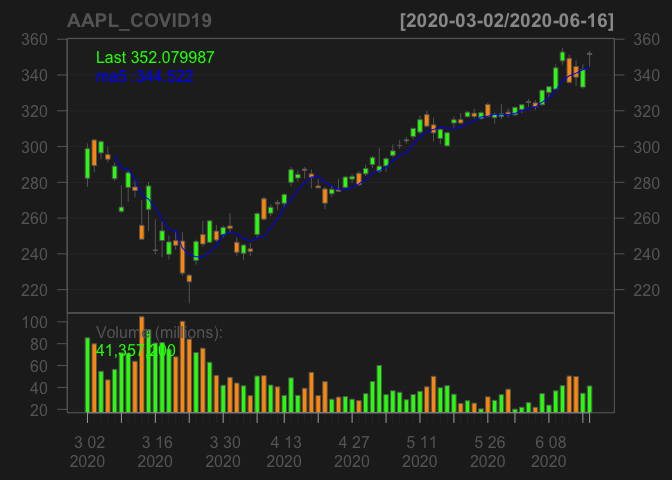<!-- -->

``` r
addTA(ma20,on=1,col="red")
```

<!-- -->

``` r
addTA(ma60,on=1,col="green")
```

<!-- -->

``` r
#BBands
addBBands()
```

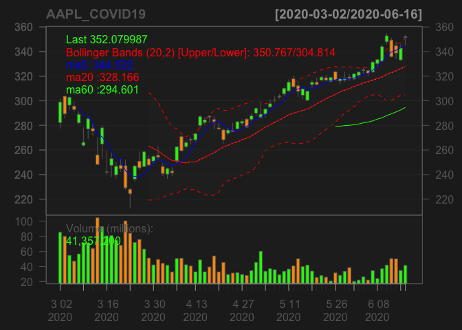<!-- -->

## AR

``` r
library(ggplot2)
getSymbols("AAPL",from = "2007-01-03",to = "2020-03-01")
```

    ## [1] "AAPL"

``` r
myStock <- AAPL

myStock <- as.data.frame(myStock)
myStock$Date <- rownames(myStock)
myStock$Date <- as.Date(myStock$Date )
ggplot(data = myStock,aes(x=Date, y=AAPL.Close))+ geom_line()+
  labs(title='上市以來蘋果的收盤價')
```

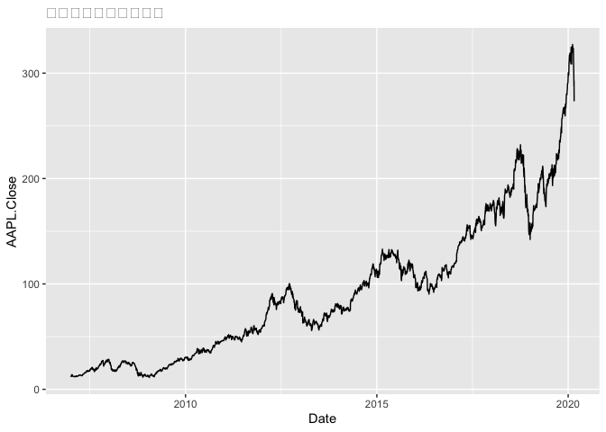<!-- -->

``` r
vec <-  c()
for(p in c(1:20)){
  mod <- ar.ols(myStock$AAPL.Close,order = p)
  aka <- log(sum(mod$resid^2, na.rm = T)/mod$n.used)+ 2*(p+1)/mod$n.used #AIC
  sch <- log(sum(mod$resid^2, na.rm = T)/mod$n.used)+ (p+1)*log(mod$n.used)/mod$n.used  #BIC
  vec <- c(vec, as.integer(p), aka, sch)
}


info<-data.frame(matrix(vec, nrow=20, ncol = 3, byrow = T))
colnames(info) <- c('Lagged Period','AIC','BIC')  
matplot(info[,c(2:3)], type = c("l"), pch=1,col=1:2)  
legend("topleft", legend = c("AIC","BIC"),col=1:2,pch=1)
```

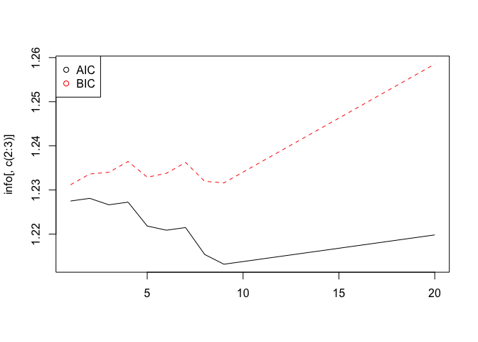<!-- -->

``` r
model <- ar.ols(myStock$AAPL.Close,order=which.min(info$AIC))
date_seq = seq(as.Date('2020-03-01'),as.Date('2020-03-01')+89, by = 1)
dat <- data.frame(Date=as.Date(date_seq),
                  AAPL.Close = as.numeric(predict(mod, n.ahead = 90)$pred),
                  group = 'pred',
                  stringsAsFactors = F)

AAPL_dat<- myStock[,c('Date','AAPL.Close')]
AAPL_dat$group = 'orginal'
AAPL_dat <- rbind(dat, AAPL_dat)

ggplot(data = AAPL_dat)+
  geom_line(aes(x=Date,y=AAPL.Close, colour=group),size = 1.2)+
  labs(title='AAPL AR(9) Model Prediction')
```

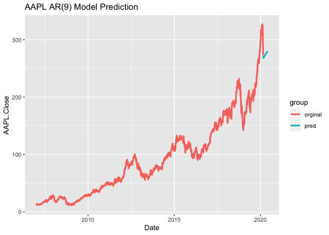<!-- -->

## 探討公司財報與營收對於股價之影響

``` r
library(quantmod)
getSymbols("AAPL")
```

    ## [1] "AAPL"

``` r
myStock <- AAPL
myStock= as.data.frame(to.quarterly(AAPL))
rownames(myStock) = gsub(" Q1","-01-01",rownames(myStock))
rownames(myStock) = gsub(" Q2","-04-01",rownames(myStock))
rownames(myStock) = gsub(" Q3","-07-01",rownames(myStock))
rownames(myStock) = gsub(" Q4","-10-01",rownames(myStock))
date <- as.Date(rownames(myStock))
myStock <- xts(myStock, date)

require(TTR)
#install.packages("randomForest")
myTTR <- function(data){
  names(data) <- sapply(X=names(data), FUN=function(x) strsplit(x, split=".", fixed=TRUE)[[1]][2])
  #HLC : Object that is coercible to xts or matrix and contains High-Low-Close prices
  myATR <- ATR(HLC(data))$atr #average true range 
  mySMI <- SMI(HLC(data))$SMI #The SMI relates the close to the midpoint of the high/low range
  myADX <- ADX(HLC(data))$ADX #Directional Movement Index
  myAroon <- aroon(HLC(data)[,-3])$oscillator #AROON指標
  myBBands <- BBands(HLC(data))$pctB #Bollinger Bands are a way to compare a security’s volatility and price levels over a period of time.
  myChaikin <- Delt(chaikinVolatility(HLC(data)[,-3]))[,1] #A object of the same class as HLC and volume or a vector (if try.xts fails) containing the accumulation / distribution values.
  #The Close Location Value (CLV) relates the day’s close to its trading range.
  myCLV <- EMA(CLV(HLC(data)))[,1] #Exponential moving average.
  myMACD <- MACD(data[,"Close"])[,2] #signal
  myMFI <- MFI(HLC(data), data[,"Volume"])
  mySAR <- SAR(data[,c("High", "Close")])[,1]
  
  result <- cbind(myATR, mySMI, myADX, myAroon, myBBands, myChaikin, myCLV, myMACD, myMFI, mySAR)
  colnames(result) <- cbind("myATR", "mySMI", "myADX", "myAroon", "myBBands", "myChaikin", "myCLV", "myMACD", "myMFI", "mySAR") 
  return(result) 
}

mystockTTR<-as.data.frame(myTTR(myStock))
mystockTTR$Date <- rownames(mystockTTR)

#爬蟲
library(jsonlite)
appleUrl<-"248,241,750,243,11503,251,11504,250,1788,264,265,1707,238,239,240,242"
apple<-fromJSON(appleUrl)

a1<-data.frame(apple$data$`c:248`$s[1])
a2<-data.frame(apple$data$`c:248`$s[2])
a2<-merge(a1,a2,by="X1",all=T)

TotalRevenue<-data.frame(Date=a2$X1,
                         TotalRevenue=a2$X2.x,
                         AnnualGrowthRate=a2$X2.y)

mystockTTR<-merge(mystockTTR,TotalRevenue, by = "Date", all = T)

a2<-data.frame(apple$data$`c:1788`$s)
a2_1<-a2[,1:22]
a2_1<-a2_1[-c(2:4),]
a2_1<-t(a2_1)
a2_2<-a2[,23:44]
a_final<-as.data.frame(t(a2_2))
colnames(a_final) <- c("GrossMargin","OperatingRate","NetInterestRate","EarningsPerShare")
rownames(a_final) <- c(1:22)
a_final$Date<-a2_1
a_final<-data.frame(a_final)
mystockTTR<-merge(mystockTTR,a_final, by = "Date", all = T)

myStock<-as.data.frame(myStock)
myStock$Date<-rownames(myStock)
mystockTTR<-merge(mystockTTR,myStock, by = "Date", all = T)

test<-mystockTTR[34:54,]
test$TotalRevenue<-as.double(test$TotalRevenue)
test$GrossMargin<-as.double(test$GrossMargin)
test$OperatingRate<-as.double(test$OperatingRate)
test$NetInterestRate<-as.double(test$NetInterestRate)
test$EarningsPerShare<-as.double(test$EarningsPerShare)
rownames(test)<-c(1:21)
knitr::kable(tail(test))
```

|    | Date       |    myATR |    mySMI |    myADX | myAroon |  myBBands |   myChaikin |     myCLV |   myMACD |    myMFI |    mySAR | TotalRevenue | AnnualGrowthRate | GrossMargin | OperatingRate | NetInterestRate | EarningsPerShare | AAPL.Open | AAPL.High | AAPL.Low | AAPL.Close | AAPL.Volume | AAPL.Adjusted |
| -- | :--------- | -------: | -------: | -------: | ------: | --------: | ----------: | --------: | -------: | -------: | -------: | -----------: | :--------------- | ----------: | ------------: | --------------: | ---------------: | --------: | --------: | -------: | ---------: | ----------: | ------------: |
| 16 | 2019-01-01 | 29.31524 | 54.95085 | 42.78239 |      95 | 0.8008663 |   0.1404758 | 0.2419327 | 26.40591 | 60.66579 | 157.7400 |           37 | \-4.51           |           5 |            14 |              19 |               20 |    154.89 |    197.69 |   142.00 |     189.95 |  1951609400 |      186.9897 |
| 17 | 2019-04-01 | 30.43844 | 53.74254 | 42.25545 |      90 | 0.8879566 |   0.1405736 | 0.2393626 | 26.00998 | 68.18027 | 175.9152 |           29 | \-5.11           |           2 |             3 |               6 |               11 |    191.64 |    215.31 |   170.27 |     197.92 |  1760761600 |      195.5858 |
| 18 | 2019-07-01 | 30.68141 | 55.93069 | 42.05682 |      50 | 0.9613210 | \-0.2183159 | 0.3513332 | 25.76950 | 75.42482 | 189.7284 |           25 | 1.02             |           1 |             1 |               2 |                8 |    203.17 |    226.42 |   192.58 |     223.97 |  1697598700 |      222.1695 |
| 19 | 2019-10-01 | 34.12131 | 60.86364 | 43.13493 |      70 | 1.1407339 |   0.4575434 | 0.4677967 | 26.10995 | 82.00415 | 200.2264 |           33 | 1.81             |           4 |             7 |              10 |               15 |    225.07 |    293.97 |   215.13 |     293.65 |  1653832900 |      292.1638 |
| 20 | 2020-01-01 | 39.91550 | 59.10200 | 44.55306 |      75 | 1.0215173 |   0.4128729 | 0.3324445 | 26.34137 | 68.15725 | 224.5997 |           39 | 8.91             |          10 |            15 |              22 |               21 |    296.24 |    327.85 |   212.61 |     254.29 |  3058256600 |      253.6035 |
| 21 | 2020-04-01 | 46.74154 | 61.20261 | 46.29730 |      80 | 1.1263124 |   0.2911915 | 0.4034921 | 27.08863 | 70.98054 | 253.5098 |           30 | 0.51             |          11 |             2 |               5 |               12 |    246.50 |    372.38 |   236.90 |     353.63 |  2260720900 |      353.6300 |

## 蘋果總營收、毛利率、營業利潤率、每股盈餘走勢圖

``` r
AAPL_TotalRevenue<-ggplot(test, aes(x = Date, y = TotalRevenue, group = 1)) + geom_line()    +theme(axis.text.x=element_text(angle=90,hjust=1,vjust=0.5))+labs(title='總營收')
AAPL_TotalRevenue
```

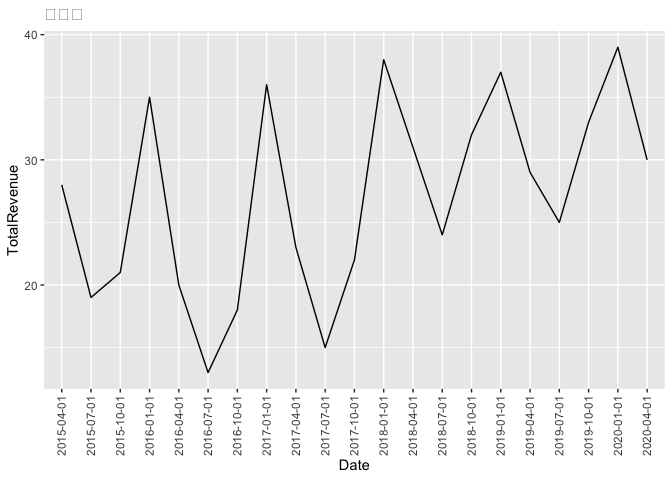<!-- -->

``` r
AAPL_GrossMargin<-ggplot(test, aes(x = Date, y = GrossMargin, group = 1)) + geom_line() +theme(axis.text.x=element_text(angle=90,hjust=1,vjust=0.5))+labs(title='毛利率')
AAPL_GrossMargin
```

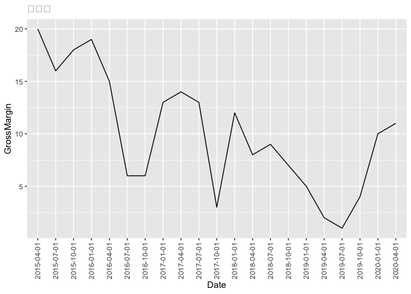<!-- -->

``` r
AAPL_OperatingRate<-ggplot(test, aes(x = Date, y = OperatingRate, group = 1)) + geom_line() +theme(axis.text.x=element_text(angle=90,hjust=1,vjust=0.5))+labs(title='營業利潤率')
AAPL_OperatingRate
```

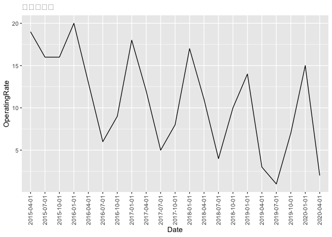<!-- -->

``` r
AAPL_EarningsPerShare<-ggplot(test, aes(x = Date, y = EarningsPerShare, group = 1)) + geom_line() +theme(axis.text.x=element_text(angle=90,hjust=1,vjust=0.5))+labs(title='每股盈餘')
AAPL_EarningsPerShare
```

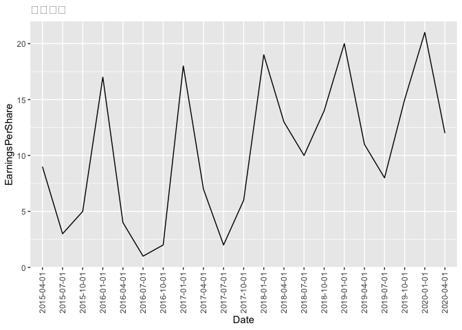<!-- -->

## 收盤價回歸

``` r
b3<-lm(`AAPL.Close`~GrossMargin+OperatingRate+NetInterestRate+EarningsPerShare, data =test, na.rm=F)
summary(b3)
```

    ## 
    ## Call:
    ## lm(formula = AAPL.Close ~ GrossMargin + OperatingRate + NetInterestRate + 
    ##     EarningsPerShare, data = test, na.rm = F)
    ## 
    ## Residuals:
    ##     Min      1Q  Median      3Q     Max 
    ## -46.244 -20.597  -5.294  23.377  59.594 
    ## 
    ## Coefficients:
    ##                  Estimate Std. Error t value Pr(>|t|)    
    ## (Intercept)      172.5064    22.4582   7.681 9.36e-07 ***
    ## GrossMargin        4.2678     2.2651   1.884 0.077845 .  
    ## OperatingRate    -12.1749     2.9468  -4.132 0.000783 ***
    ## NetInterestRate   -0.1923     3.6709  -0.052 0.958871    
    ## EarningsPerShare   8.7750     2.6710   3.285 0.004661 ** 
    ## ---
    ## Signif. codes:  0 '***' 0.001 '**' 0.01 '*' 0.05 '.' 0.1 ' ' 1
    ## 
    ## Residual standard error: 35.34 on 16 degrees of freedom
    ## Multiple R-squared:  0.7787, Adjusted R-squared:  0.7234 
    ## F-statistic: 14.08 on 4 and 16 DF,  p-value: 4.157e-05

在AR的預測下我們看到近三個月的趨勢，正在向上爬升中 在回歸之中我們看到營業利潤率、每股盈餘的高度相關 那勢必就是到了預測該不該買的時候了

# 訓練-股價預測模型

## step1模型建立

## 定義功能以衡量績效

``` r
library(quantmod)
getSymbols("AAPL")
```

    ## [1] "AAPL"

``` r
myStock <- AAPL
colnames(myStock) = paste("myStock",c("Open","High","Low","Close","Volume","Adjusted"), sep=".")
p <- 0.025
k <- 10
T.index <- function(data,p,k){
  require(quantmod)
  hlc = HLC(data)
  P <- rowMeans(hlc)
  V <- matrix(NA, ncol=k, nrow=NROW(P))
  for (i in 1:k) {
    V[,i] <- Next(Delt(P,k=i),k=i)
  }
  T <- apply(V,1,function(x) sum(x,na.rm=TRUE))
  T <- xts(x=T, order.by=time(data))
  return(T)
}
```

## 預測指標

``` r
myTTR <- function(data){
  require(TTR)
  #install.packages("randomForest")
  require(quantmod)
  names(data) <- sapply(X=names(data), FUN=function(x) strsplit(x, split=".", fixed=TRUE)[[1]][2]) # change [2] 
  myATR <- ATR(HLC(data))$atr
  mySMI <- SMI(HLC(data))$SMI
  myADX <- ADX(HLC(data))$ADX
  myAroon <- aroon(HLC(data)[,-3])$oscillator
  myBBands <- BBands(HLC(data))$pctB
  myChaikin <- Delt(chaikinVolatility(HLC(data)[,-3]))[,1]
  myCLV <- EMA(CLV(HLC(data)))[,1]
  myMACD <- MACD(data[,"Close"])[,2]
  myMFI <- MFI(HLC(data), data[,"Volume"])
  mySAR <- SAR(data[,c("High", "Close")])[,1]
  
  result <- cbind(myATR, mySMI, myADX, myAroon, myBBands, myChaikin, myCLV, myMACD, myMFI, mySAR)
  colnames(result) <- cbind("myATR", "mySMI", "myADX", "myAroon", "myBBands", "myChaikin", "myCLV", "myMACD", "myMFI", "mySAR") 
  return(result) 

}
```

## 模型設置

``` r
rm(myTTR.data, model.data, train.data, test.data)
myTTR.data <- myTTR(myStock)[,c("myATR", "myADX", "myMACD", "mySAR", "mySMI")]
model.data <- specifyModel(formula=T.index(myStock, p=0.025, k=10) ~ myTTR.data + runMean(Cl(myStock)) )
train.data <- as.data.frame(modelData(model.data, 
                                      data.window=c(start(myStock), as.Date("2013-12-31")) )) #Books Error was here
test.data <- as.data.frame(modelData(model.data, 
                                     data.window=c(as.Date("2014-01-01"), end(myStock)) ))
colnames(train.data) <- c("T", "myATR", "myADX", "myMACD", "mySAR", "mySMI", "runMean")
colnames(test.data) <- c("T", "myATR", "myADX", "myMACD", "mySAR", "mySMI", "runMean")
form <- as.formula("T~.")
```

## 擬合模型

``` r
svm.model <- svm(form, train.data, cost=100)
svm.predict <- predict(svm.model, na.omit(test.data))
```

## 將得到數據轉為買入/持有/賣出訊號

``` r
# Transform from T.Index to Buy/Hold/Sell Signal
T2Signal <- function(x, a1=-0.01, a2=-a1){
  result <- ifelse(x<a1, "Sell", ifelse(x>a2, "Buy", "Hold"))
  result <- factor(result, levels=c("Buy", "Hold", "Sell"))
  return(result)
}

accuracy2 <- function(prediction, true){
  t <- table(prediction, true)
  result <- (t["Sell", "Sell"] + t["Buy", "Buy"]) / (t["Sell", "Sell"] + t["Buy", "Buy"] + t["Sell", "Buy"] + t["Buy", "Sell"])
  return(result)
}
```

## step2 開始測試

``` r
getSymbols("AAPL")
```

    ## [1] "AAPL"

``` r
myStock <- AAPL
colnames(myStock) = paste("myStock", c("Open","High","Low","Close","Volume","Adjusted"), sep=".")
```

## 指標依據

``` r
myTTR.data <- myTTR(myStock)[,c("myATR", "myADX", "myMACD", "mySAR", "mySMI")]
model.data <- specifyModel(formula=T.index(myStock, p=0.025, k=10) ~ myTTR.data + runMean(Cl(myStock)) )
```

## 從上市-到2020-0301為訓練模型

``` r
train.data <- as.data.frame(modelData(model.data, data.window=c(start(myStock), as.Date("2020-03-01"))))
```

## 從2020-03-02到現在為測試模型–期間正是美國疫情爆發期

``` r
test.data <- as.data.frame(modelData(model.data, data.window=c(as.Date("2020-03-02"), end(myStock))))
```

## 分組模擬

``` r
colnames(train.data) <- c("T", "myATR", "myADX", "myMACD", "mySAR", "mySMI", "runMean")
colnames(test.data) <- c("T", "myATR", "myADX", "myMACD", "mySAR", "mySMI", "runMean")
form <- as.formula("T~.")

rm(svm.model, svm.predict, signal.pred, signal.true)
svm.model <- svm(form, train.data, cost=100)
svm.predict <- predict(svm.model, na.omit(test.data)) #預測的資料
test.data$predict<-svm.predict

signal.pred <- T2Signal(x=svm.predict, a1=-0.095, a2=0.095)
signal.true <- T2Signal(x=na.omit(test.data)$T, a1=-0.095, a2=0.095)
test.data$signal<-signal.pred
```

# 決策樹

``` r
if (!require('rpart')){
  install.packages("rpart"); library(rpart)
}
```

    ## Loading required package: rpart

``` r
DT<-rpart(signal~myATR+myADX+myMACD+mySAR+mySMI+runMean,
          data=test.data) #訓練組 Training set

DT
```

    ## n= 83 
    ## 
    ## node), split, n, loss, yval, (yprob)
    ##       * denotes terminal node
    ## 
    ## 1) root 83 10 Buy (0.87951807 0.12048193)  
    ##   2) myATR>=7.667495 76  4 Buy (0.94736842 0.05263158)  
    ##     4) myADX>=18.30194 69  0 Buy (1.00000000 0.00000000) *
    ##     5) myADX< 18.30194 7  3 Hold (0.42857143 0.57142857) *
    ##   3) myATR< 7.667495 7  1 Hold (0.14285714 0.85714286) *

``` r
if (!require('rpart.plot')){
  install.packages("rpart.plot"); 
  library(rpart.plot)
}
```

    ## Loading required package: rpart.plot

``` r
prp(DT)
```

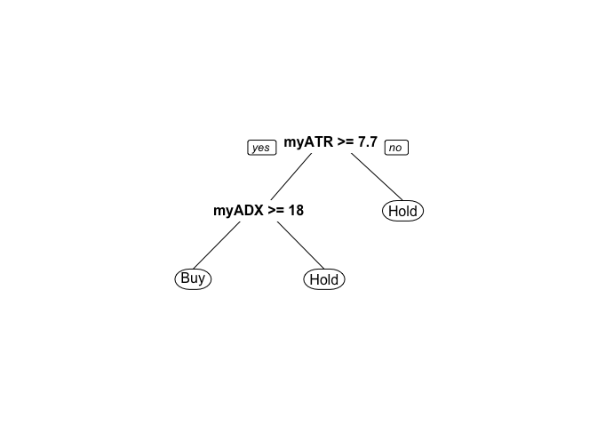<!-- -->

``` r
knitr::kable(tail(test.data))
```

|            |           T |    myATR |    myADX |   myMACD |    mySAR |    mySMI | runMean |   predict | signal |
| ---------- | ----------: | -------: | -------: | -------: | -------: | -------: | ------: | --------: | :----- |
| 2020-06-19 |   0.1524210 | 8.725797 | 41.08074 | 3.591942 | 342.2047 | 63.40020 | 345.310 | 0.1974074 | Buy    |
| 2020-06-22 |   0.0654618 | 8.798239 | 40.55663 | 3.632062 | 344.5016 | 65.47612 | 347.851 | 0.2126357 | Buy    |
| 2020-06-23 | \-0.0515719 | 9.134794 | 41.00852 | 3.706185 | 347.1941 | 66.86932 | 350.105 | 0.2588813 | Buy    |
| 2020-06-24 | \-0.0141258 | 9.215882 | 40.81573 | 3.758519 | 352.2313 | 65.87811 | 350.827 | 0.2640419 | Buy    |
| 2020-06-25 | \-0.0141989 | 9.088318 | 40.48186 | 3.807065 | 356.2610 | 65.39851 | 353.721 | 0.2411764 | Buy    |
| 2020-06-26 |   0.0000000 | 9.317725 | 39.44441 | 3.790620 | 372.3800 | 61.91277 | 355.204 | 0.2482069 | Buy    |

# 預測比對

``` r
table(signal.pred, signal.true)
```

    ##            signal.true
    ## signal.pred Buy Hold Sell
    ##        Buy   45   14   14
    ##        Hold  10    0    0
    ##        Sell   0    0    0

# 準確率

``` r
accuracy2(signal.pred, signal.true)
```

    ## [1] 0.7627119

在判斷完是不是要下手之後，接著就是到底賺多少的問題了

# 疫情期間持有股票的交易分析

## 有多少天的數據？

    ## [1] 75

## 期間每筆交易的損益

    ## 2020-03-02 2020-03-03 2020-03-04 2020-03-05 2020-03-06 2020-03-09 2020-03-10 
    ##  16.529999 -14.350006   6.299988  -2.599976   7.029999   2.420013   8.199981 
    ## 2020-03-11 2020-03-12 2020-03-13 2020-03-16 2020-03-17 2020-03-18 2020-03-19 
    ##  -1.960022  -7.710006  13.079986   0.260010   5.350006   6.899994  -2.610000 
    ## 2020-03-20 2020-03-23 2020-03-24 2020-03-25 2020-03-26 2020-03-27 2020-03-30 
    ## -17.939988  -3.710007  10.520004  -5.229996  11.919998  -5.009995   4.069993 
    ## 2020-03-31 2020-04-01 2020-04-02 2020-04-03 2020-04-06 2020-04-07 2020-04-08 
    ##  -1.310013  -5.589996   4.589997  -1.389999  11.570007 -11.369995   3.330017 
    ## 2020-04-09 2020-04-13 2020-04-14 2020-04-15 2020-04-16 2020-04-17 2020-04-20 
    ##  -0.710022   4.940002   7.049988   2.029999  -0.690003  -1.890014  -1.020019 
    ## 2020-04-21 2020-04-22 2020-04-23 2020-04-24 2020-04-27 2020-04-28 2020-04-29 
    ##  -7.910004   2.490021  -0.839996   5.769989   1.370025  -6.500000   3.000000 
    ## 2020-04-30 2020-05-01 2020-05-04 2020-05-05 2020-05-06 2020-05-07 2020-05-08 
    ##   3.839997   2.820007   3.989991   2.500000   0.170014   0.519989   4.489990 
    ## 2020-05-11 2020-05-12 2020-05-13 2020-05-14 2020-05-15 2020-05-18 2020-05-19 
    ##   6.910004  -6.419983  -4.500000   5.029999   7.359985   1.789978  -1.889984 
    ## 2020-05-20 2020-05-21 2020-05-22 2020-05-26 2020-05-27 2020-05-28 2020-05-29 
    ##   2.550018  -1.809998   3.120026  -6.769989   1.969970   1.480011  -1.309998 
    ## 2020-06-01 2020-06-02 2020-06-03 2020-06-04 2020-06-05 2020-06-08 2020-06-09 
    ##   4.100006   2.589996   0.459991  -2.070008   8.149994   3.209991  11.849975 
    ## 2020-06-10 2020-06-11 2020-06-12 2020-06-15 2020-06-16 
    ##   4.940002 -13.410004  -5.920013   9.739990   0.619996

## 總損益

    ## [1] 88.4799

## 累計損益

    ## 2020-03-02 2020-03-03 2020-03-04 2020-03-05 2020-03-06 2020-03-09 2020-03-10 
    ##  16.529999   2.179993   8.479981   5.880005  12.910004  15.330017  23.529998 
    ## 2020-03-11 2020-03-12 2020-03-13 2020-03-16 2020-03-17 2020-03-18 2020-03-19 
    ##  21.569976  13.859970  26.939956  27.199966  32.549972  39.449966  36.839966 
    ## 2020-03-20 2020-03-23 2020-03-24 2020-03-25 2020-03-26 2020-03-27 2020-03-30 
    ##  18.899978  15.189971  25.709975  20.479979  32.399977  27.389982  31.459975 
    ## 2020-03-31 2020-04-01 2020-04-02 2020-04-03 2020-04-06 2020-04-07 2020-04-08 
    ##  30.149962  24.559966  29.149963  27.759964  39.329971  27.959976  31.289993 
    ## 2020-04-09 2020-04-13 2020-04-14 2020-04-15 2020-04-16 2020-04-17 2020-04-20 
    ##  30.579971  35.519973  42.569961  44.599960  43.909957  42.019943  40.999924 
    ## 2020-04-21 2020-04-22 2020-04-23 2020-04-24 2020-04-27 2020-04-28 2020-04-29 
    ##  33.089920  35.579941  34.739945  40.509934  41.879959  35.379959  38.379959 
    ## 2020-04-30 2020-05-01 2020-05-04 2020-05-05 2020-05-06 2020-05-07 2020-05-08 
    ##  42.219956  45.039963  49.029954  51.529954  51.699968  52.219957  56.709947 
    ## 2020-05-11 2020-05-12 2020-05-13 2020-05-14 2020-05-15 2020-05-18 2020-05-19 
    ##  63.619951  57.199968  52.699968  57.729967  65.089952  66.879930  64.989946 
    ## 2020-05-20 2020-05-21 2020-05-22 2020-05-26 2020-05-27 2020-05-28 2020-05-29 
    ##  67.539964  65.729966  68.849992  62.080003  64.049973  65.529984  64.219986 
    ## 2020-06-01 2020-06-02 2020-06-03 2020-06-04 2020-06-05 2020-06-08 2020-06-09 
    ##  68.319992  70.909988  71.369979  69.299971  77.449965  80.659956  92.509931 
    ## 2020-06-10 2020-06-11 2020-06-12 2020-06-15 2020-06-16 
    ##  97.449933  84.039929  78.119916  87.859906  88.479902

## 每次交易的損益

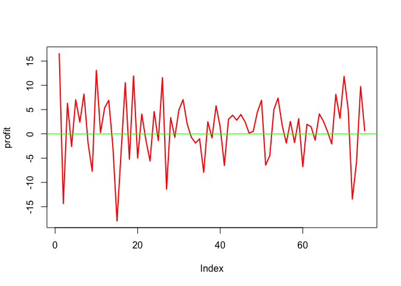<!-- -->

## 累積損益

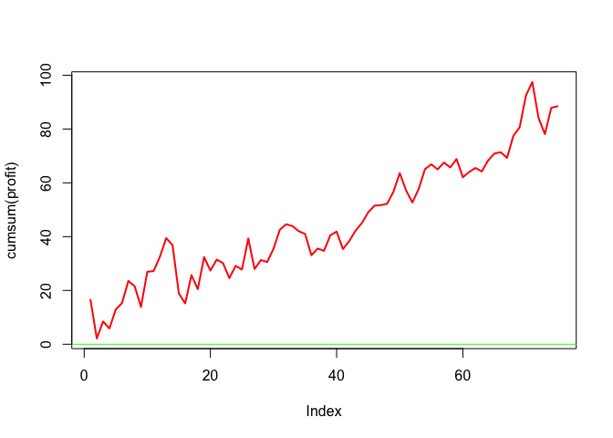<!-- -->

# 績效分析

-----

## 贏的次數

    ## [1] 46

## 勝率

    ## [1] 0.6133333

## 平均賺/賠

    ## [1] 5.063477

    ## [1] -4.980691

    ## [1] 1.016621

### 扣掉交易成本

### 股票手續費

### 成交金額\*0.1425% \#\#\# 買賣各一次 \#\#\# 小數點以下無條件捨去，不足20元以20元計

## 減去交易成本後的每次損益

    ##            AAPL_COVID19.Open AAPL_COVID19.Close        profit
    ## 2020-03-02            282.28             298.81  16.529999000
    ## 2020-03-03            303.67             289.32 -14.762287010
    ## 2020-03-04            296.44             302.74   5.868583514
    ## 2020-03-05            295.52             292.92  -3.017387019
    ## 2020-03-06            282.00             289.03   6.618131251
    ## 2020-03-09            263.75             266.17   2.040720731
    ## 2020-03-10            277.14             285.34   7.793371506
    ## 2020-03-11            277.39             275.43  -2.352509740
    ## 2020-03-12            255.94             248.23  -8.063733744
    ## 2020-03-13            264.89             277.97  12.683878749
    ## 2020-03-16            241.95             242.21  -0.085139260
    ## 2020-03-17            247.51             252.86   4.989680499
    ## 2020-03-18            239.77             246.67   6.548489253
    ## 2020-03-19            247.39             244.78  -2.958811499
    ## 2020-03-20            247.18             229.24 -18.266655007
    ## 2020-03-23            228.08             224.37  -4.029734243
    ## 2020-03-24            236.36             246.88  10.168199993
    ## 2020-03-25            250.75             245.52  -5.579862006
    ## 2020-03-26            246.52             258.44  11.551720997
    ## 2020-03-27            252.75             247.74  -5.363024507
    ## 2020-03-30            250.74             254.81   3.706888753
    ## 2020-03-31            255.60             254.29  -1.672376240
    ## 2020-04-01            246.50             240.91  -5.933292756
    ## 2020-04-02            240.34             244.93   4.240971760
    ## 2020-04-03            242.80             241.41  -1.734008256
    ## 2020-04-06            250.90             262.47  11.195987249
    ## 2020-04-07            270.80             259.43 -11.739682740
    ## 2020-04-08            262.74             266.07   2.950867240
    ## 2020-04-09            268.70             267.99  -1.091907736
    ## 2020-04-13            268.31             273.25   4.550620750
    ## 2020-04-14            280.00             287.05   6.640941767
    ## 2020-04-15            282.40             284.43   1.624686260
    ## 2020-04-16            287.38             286.69  -1.098536253
    ## 2020-04-17            284.69             282.80  -2.293003983
    ## 2020-04-20            277.95             276.93  -1.414644240
    ## 2020-04-21            276.28             268.37  -8.292431243
    ## 2020-04-22            273.61             276.10   2.096578491
    ## 2020-04-23            275.87             275.03  -1.231913749
    ## 2020-04-24            277.20             282.97   5.366756749
    ## 2020-04-27            281.80             283.17   0.966507731
    ## 2020-04-28            285.08             278.58  -6.896976481
    ## 2020-04-29            284.73             287.73   2.589984734
    ## 2020-04-30            289.96             293.80   3.421332017
    ## 2020-05-01            286.25             289.07   2.408082240
    ## 2020-05-04            289.17             293.16   3.572237994
    ## 2020-05-05            295.06             297.56   2.075977003
    ## 2020-05-06            300.46             300.63  -0.258383757
    ## 2020-05-07            303.22             303.74   0.087159514
    ## 2020-05-08            305.64             310.13   4.048054743
    ## 2020-05-11            308.10             315.01   6.461114736
    ## 2020-05-12            317.83             311.41  -6.863742256
    ## 2020-05-13            312.15             307.65  -4.938401241
    ## 2020-05-14            304.51             309.54   4.588904487
    ## 2020-05-15            300.35             307.71   6.921498263
    ## 2020-05-18            313.17             314.96   1.341160013
    ## 2020-05-19            315.03             313.14  -2.336208521
    ## 2020-05-20            316.68             319.23   2.095115234
    ## 2020-05-21            318.66             316.85  -2.261509259
    ## 2020-05-22            315.77             318.89   2.665607729
    ## 2020-05-26            323.50             316.73  -7.221329266
    ## 2020-05-27            316.14             318.11   1.516663271
    ## 2020-05-28            316.77             318.25   1.026504750
    ## 2020-05-29            319.25             317.94  -1.763062503
    ## 2020-06-01            317.75             321.85   3.641369741
    ## 2020-06-02            320.75             323.34   2.129236506
    ## 2020-06-03            324.66             325.12  -0.003304993
    ## 2020-06-04            324.39             322.32  -2.529314010
    ## 2020-06-05            323.35             331.50   7.677606500
    ## 2020-06-08            330.25             333.46   2.734810513
    ## 2020-06-09            332.14             343.99  11.359789264
    ## 2020-06-10            347.90             352.84   4.437205006
    ## 2020-06-11            349.31             335.90 -13.888661491
    ## 2020-06-12            344.72             338.80  -6.402802983
    ## 2020-06-15            333.25             342.99   9.251229264
    ## 2020-06-16            351.46             352.08   0.118282019

## 總損益

    ## [1] 57.95787

## 累積損益

    ## 2020-03-02 2020-03-03 2020-03-04 2020-03-05 2020-03-06 2020-03-09 2020-03-10 
    ##  16.529999   1.767712   7.636296   4.618908  11.237040  13.277760  21.071132 
    ## 2020-03-11 2020-03-12 2020-03-13 2020-03-16 2020-03-17 2020-03-18 2020-03-19 
    ##  18.718622  10.654888  23.338767  23.253628  28.243308  34.791798  31.832986 
    ## 2020-03-20 2020-03-23 2020-03-24 2020-03-25 2020-03-26 2020-03-27 2020-03-30 
    ##  13.566331   9.536597  19.704797  14.124935  25.676656  20.313631  24.020520 
    ## 2020-03-31 2020-04-01 2020-04-02 2020-04-03 2020-04-06 2020-04-07 2020-04-08 
    ##  22.348144  16.414851  20.655823  18.921815  30.117802  18.378119  21.328986 
    ## 2020-04-09 2020-04-13 2020-04-14 2020-04-15 2020-04-16 2020-04-17 2020-04-20 
    ##  20.237079  24.787699  31.428641  33.053328  31.954791  29.661787  28.247143 
    ## 2020-04-21 2020-04-22 2020-04-23 2020-04-24 2020-04-27 2020-04-28 2020-04-29 
    ##  19.954712  22.051290  20.819377  26.186133  27.152641  20.255665  22.845649 
    ## 2020-04-30 2020-05-01 2020-05-04 2020-05-05 2020-05-06 2020-05-07 2020-05-08 
    ##  26.266981  28.675064  32.247302  34.323279  34.064895  34.152054  38.200109 
    ## 2020-05-11 2020-05-12 2020-05-13 2020-05-14 2020-05-15 2020-05-18 2020-05-19 
    ##  44.661224  37.797482  32.859080  37.447985  44.369483  45.710643  43.374435 
    ## 2020-05-20 2020-05-21 2020-05-22 2020-05-26 2020-05-27 2020-05-28 2020-05-29 
    ##  45.469550  43.208040  45.873648  38.652319  40.168982  41.195487  39.432424 
    ## 2020-06-01 2020-06-02 2020-06-03 2020-06-04 2020-06-05 2020-06-08 2020-06-09 
    ##  43.073794  45.203031  45.199726  42.670412  50.348018  53.082829  64.442618 
    ## 2020-06-10 2020-06-11 2020-06-12 2020-06-15 2020-06-16 
    ##  68.879823  54.991161  48.588359  57.839588  57.957870

## 因交易成本造成的損失

    ## [1] 30.52203

## 扣掉交易成本後的累積損益

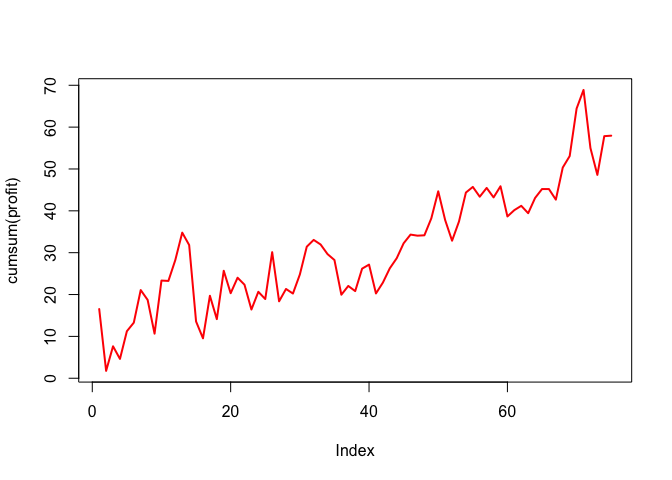<!-- -->

## 扣掉交易成本後的損益

<!-- -->
